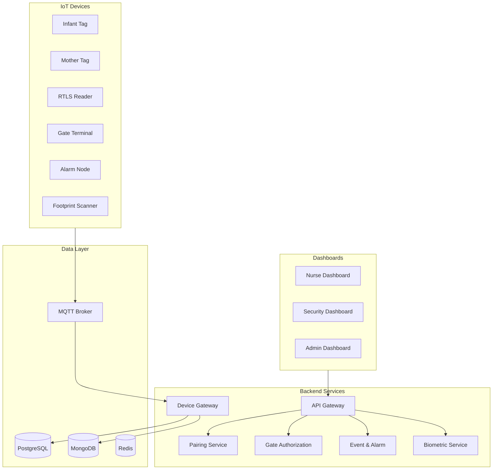

# 🏥 Infant-Stack

[](https://github.com/YOUR_ORG/infant-stack/actions/workflows/ci.yml)
[](LICENSE)
[](CONTRIBUTING.md)

**A comprehensive, open-source infant security ecosystem for hospitals** featuring real-time location tracking (RTLS), gate authorization, biometric identification, and monitoring dashboards.

---

## 🏗️ Architecture



### Tech Stack

| Layer | Technology |
|-------|------------|
| Backend | Python 3.11, FastAPI, SQLAlchemy |
| Frontend | React 18, TypeScript, Vite, TailwindCSS |
| Primary DB | PostgreSQL 15 |
| Time-series DB | MongoDB 6 |
| Message Broker | Eclipse Mosquitto (MQTT) |
| Cache | Redis 7 |
| Container | Docker, Kubernetes |
| CI/CD | GitHub Actions |

---

## 🚀 Quick Start

### Prerequisites

- Docker & Docker Compose v2.x
- Node.js 20 LTS (for frontend development)
- Python 3.11+ (for backend development)

### One-Command Setup

```bash
# Clone the repository
git clone https://github.com/omarsl530/infant-stack.git
cd infant-stack

# Start all services
docker-compose up -d

# Verify services are running
docker-compose ps
```

### Access Points

| Service | URL |
|---------|-----|
| Nurse Dashboard | http://localhost:3000 |
| Security Dashboard | http://localhost:3001 |
| Admin Dashboard | http://localhost:3002 |
| API Gateway | http://localhost:8000/docs |
| MQTT Broker | localhost:1883 |

---

## 📁 Repository Structure

```
infant-stack/
├── backend/
│   ├── services/
│   │   ├── device-gateway/      # MQTT message handler
│   │   ├── pairing-service/     # Infant-mother pairing
│   │   ├── gate-authorization/  # Exit authorization
│   │   ├── event-alarm-service/ # Alert management
│   │   ├── biometric-service/   # Footprint matching
│   │   └── user-role-service/   # Authentication
│   ├── api-gateway/             # API routing & auth
│   ├── database/
│   │   ├── migrations/          # SQL migrations
│   │   └── orm-models/          # SQLAlchemy models
│   └── shared-libraries/        # Common utilities
├── dashboards/
│   ├── nurse-dashboard/         # Real-time monitoring
│   ├── security-dashboard/      # Alerts & gate control
│   ├── admin-dashboard/         # System configuration
│   └── shared-components/       # Reusable UI components
├── firmware/                    # Device firmware
├── hardware/                    # Schematics & CAD
├── simulations/                 # Device simulators
├── devops/
│   ├── kubernetes/              # K8s manifests
│   ├── docker/                  # Dockerfiles
│   └── infrastructure-as-code/  # Terraform
├── docs/                        # Documentation
├── qa/                          # Test plans & automation
└── tools/                       # Utilities & scripts
```

---

## 🛠️ Development

### Backend Development

```bash
cd backend
python -m venv .venv
source .venv/bin/activate  # Linux/macOS
pip install -e ".[dev]"

# Run tests
pytest -v

# Start device gateway
python -m services.device_gateway.main
```

### Frontend Development

```bash
cd dashboards/nurse-dashboard
npm install
npm run dev
```

### Running Tests

```bash
# All tests with coverage
docker-compose -f docker-compose.test.yml up --abort-on-container-exit

# Linting
pre-commit run --all-files
```

---

## 🔐 Security

This system handles sensitive patient data. See [SECURITY.md](SECURITY.md) for:

- Vulnerability reporting procedures
- Security controls and compliance
- Credential management guidelines

---

## 🤝 Contributing

Contributions are welcome! Please read [CONTRIBUTING.md](CONTRIBUTING.md) for:

- Code of conduct
- Development workflow
- Pull request requirements
- Code style guidelines

---

## 📄 License

This project is licensed under the MIT License - see [LICENSE](LICENSE) for details.

---

## 📚 Documentation

- [System Architecture](docs/architecture/system-architecture.md)
- [API Documentation](docs/specifications/api-specification.md)
- [Database Schema](docs/specifications/database-schema.md)
- [Deployment Guide](docs/deployment.md)

---

## 🙏 Acknowledgments

Built with these excellent open-source projects:

- [FastAPI](https://github.com/tiangolo/fastapi) - Modern Python web framework
- [React](https://github.com/facebook/react) - UI library
- [TailwindCSS](https://github.com/tailwindlabs/tailwindcss) - Utility-first CSS
- [Eclipse Mosquitto](https://github.com/eclipse/mosquitto) - MQTT broker
- [PostgreSQL](https://www.postgresql.org/) - Relational database
